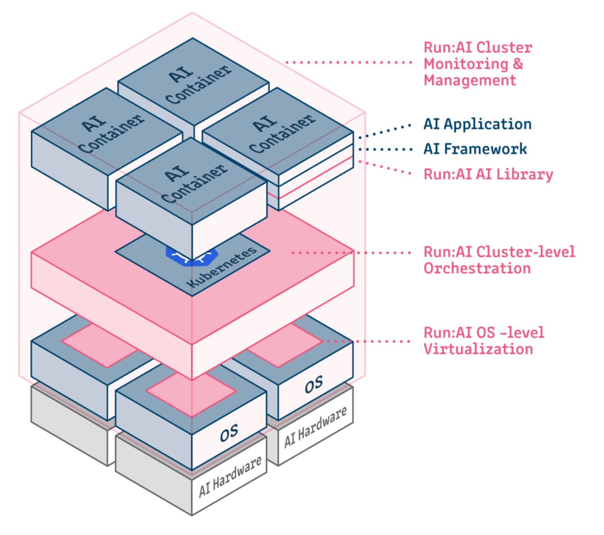

# Docker 사용하기

- Docker는 애플리케이션을 컨테이너(container) 라는 단위로 패키징하고 실행할 수 있게 해주는 플랫폼입니다.
- 컨테이너(container): 애플리케이션과 필요한 모든 환경을 함께 패키징한 가벼운 실행 단위

## Docker 구성 요소

| 구성요소           | 설명                     |
| -------------- | ---------------------- |
| **Dockerfile** | 이미지를 만드는 설정파일 (환경 정의서) |
| **Image**      | 실행 가능한 앱 + 환경이 포함된 템플릿 |
| **Container**  | 이미지가 실제 실행되고 있는 인스턴스   |
| **Docker Hub** | 공개 이미지 저장소 (GitHub처럼)  |

## Docker 아키텍처

## Dockerfile

Dockerfile을 만들 때는 단순히 잘 작동하는 것보다, 작고, 빠르고, 보안상 안전한 컨테이너를 만드는 것이 중요합니다.
아래는 Dockerfile을 작성할 때 꼭 고려해야 할 주의사항과 베스트 프랙티스입니다.

여기서 사용하고 있는 [Dockerfile](../Dockerfile) 분석을 통해 사용법을 알아 가시면 좋겠습니다.

### 🐳 Dockerfile 작성 시 주의사항 및 베스트 프랙티스 요약

#### 🧱 기본 원칙 (From [Docker Docs - Best Practices](https://docs.docker.com/build/building/best-practices/?utm_source=chatgpt.com))

- `FROM`은 가볍고 검증된 이미지 사용 (`python:3.10-slim`, `alpine` 등)
- `.dockerignore` 파일로 빌드 컨텍스트 최소화
- `RUN` 명령어는 `&&`로 묶어 레이어 수 최소화
- `COPY` 순서 최적화하여 Docker 빌드 캐시 최대한 활용
- `CMD`는 기본 실행 명령, `ENTRYPOINT`는 실행 진입점으로 구분하여 사용

#### 🧹 이미지 최적화 (From [Multi-stage Builds Guide](https://docs.docker.com/develop/develop-images/multistage-build/?utm_source=chatgpt.com))

- 멀티스테이지 빌드 사용해 실행 이미지 경량화
- 빌드 도구는 `builder` 스테이지에서만 사용
- 필요한 결과물만 `COPY --from=builder`로 복사

#### 🔐 보안 강화 (From [Sysdig Guide](https://sysdig.com/learn-cloud-native/dockerfile-best-practices/?utm_source=chatgpt.com))

- `USER`를 설정해 루트 권한 대신 일반 사용자로 실행
- `HEALTHCHECK`로 컨테이너 상태 모니터링
- `.env`, `.pem`, `.key` 등 시크릿 파일은 이미지에 포함 금지
- `docker scan`, `trivy` 등을 이용한 이미지 취약점 검사 권장

#### 🚀 빌드 및 실행 성능 향상 (From [Divio Guide](https://doc.sitecore.com/xp/en/developers/latest/developer-tools/dockerfile-best-practices-and-scenarios.html?utm_source=chatgpt.com))

## Docker compose 역활

- 여러 개의 컨테이너(서비스)를 하나의 설정 파일로 정의하고 관리
- `docker-compose.yml` 파일 하나로 전체 서비스 구성 자동화
- 네트워크, 볼륨, 환경변수 설정 등을 선언적으로 구성
- `build`, `run`, `stop`, `logs` 등을 간단한 명령어로 일괄 수행
- 애플리케이션을 **마이크로서비스 아키텍처**로 분리하여 운영 가능
- 개발, 테스트, 배포 환경에서 동일한 구성을 쉽게 재현 가능
- `depends_on` 기능으로 컨테이너 간 **의존 관계**를 정의할 수 있음
- 기본적으로 **동일 네트워크**에서 컨테이너들이 이름으로 통신 가능

## AI Containers

